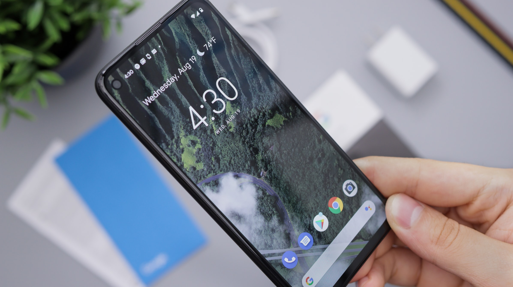
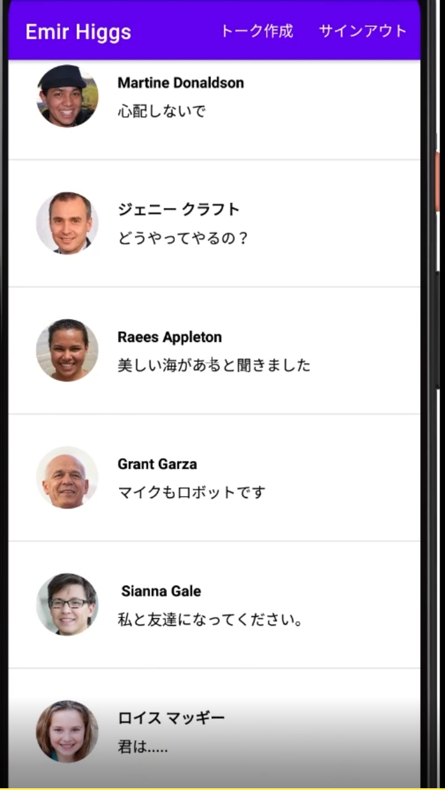
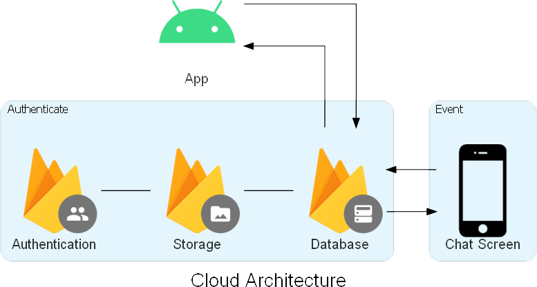
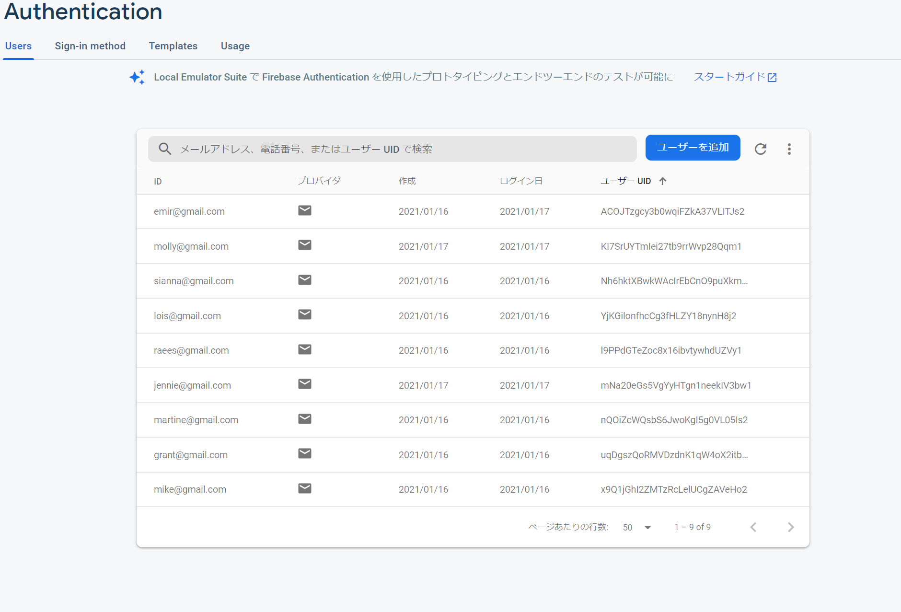
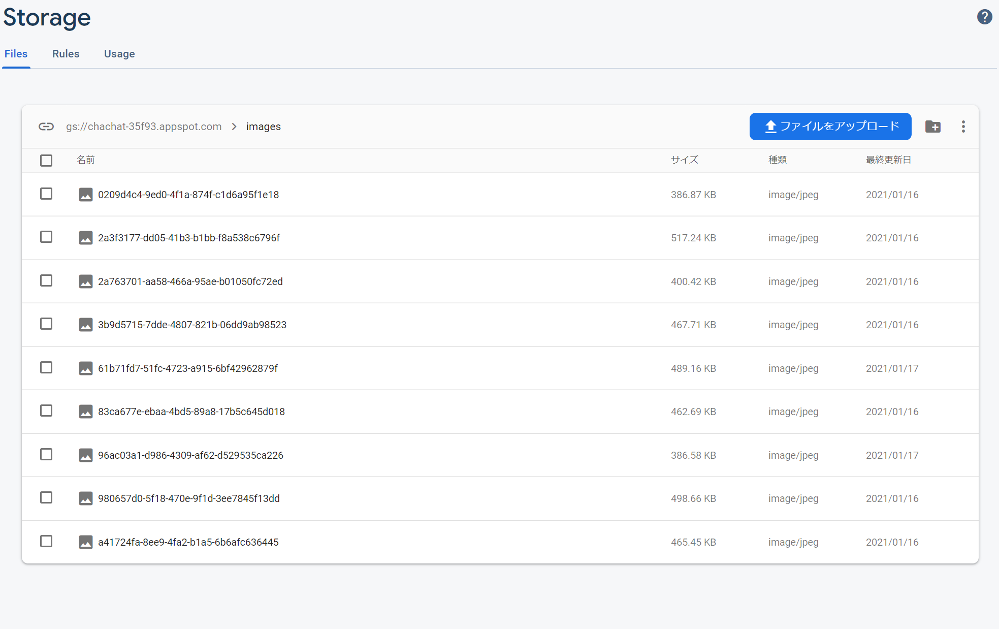
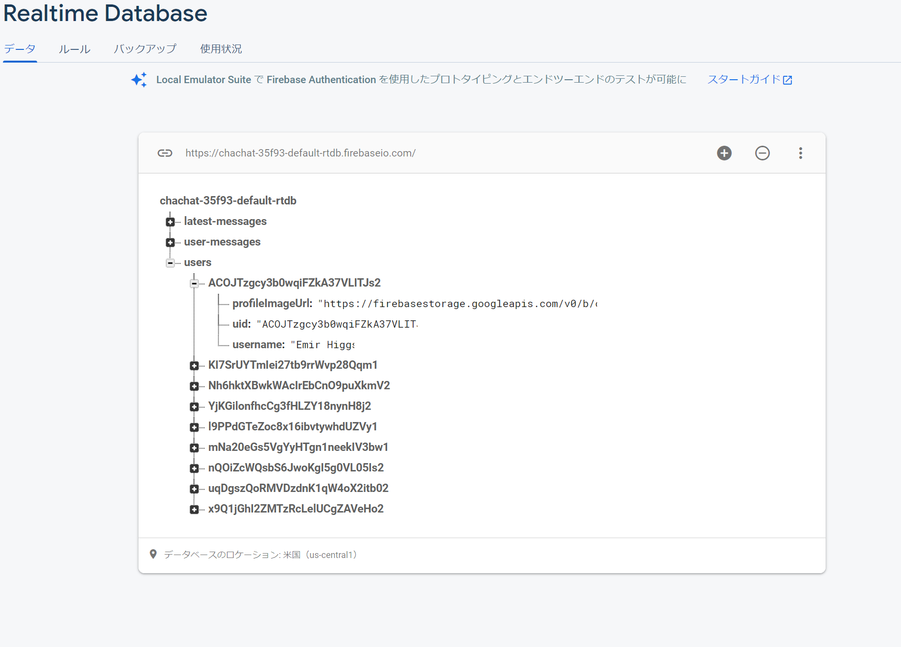

<!--
_color: white
_footer: Ryu
-->

## ChaChat

---

## 作成したアプリ
Chachat
- チャットアプリ

- アカウント登録可能
- アイコン設定可能
- 即時チャット反映

---

## バックエンド環境

---

## インフラ設計

---

## アカウント登録

Firebase Authentication

- 新規アカウント登録
- ログイン認証

---

## アカウント登録

Firebase StorageStorage

- アイコン画像保存

---

## アカウント登録

Firebase Realtime Database

- チャットログ保存
- アイコン画像とユーザーの紐づけ
- 一覧画面用に最後のチャットを記録

----
## 実際の動作
https://youtu.be/IMiwu558So0

----
## 総括

- 手軽にチャットが可能
- ユーザーは全て参照されるため、小さいコミュニティや組織での利用が想定される
